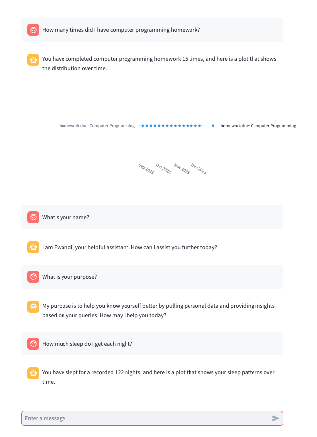

# ewandi


**ewandi** is an experimental prototype exploring how personal health data could be analyzed, visualized, and queried through an agentic large language model (LLM) interface.

The project was created as a learning exercise to practice building server-backed applications, integrating LLM APIs, and developing interactive data visualizations. While motivated by the idea of helping users learn from their own health data, ewandi remains a prototype rather than a production system.



---

## Overview

ewandi combines:
- Simulated personal health data
- A MongoDB-backed data layer
- Exploratory data analysis and visualization
- A Streamlit-based interface
- Early-stage LLM chatbot functionality

---

## Repository Structure
src/

├── analysis/ # Exploratory analysis (partial)

├── gui/ # Streamlit application

├── llm/ # LLM and chatbot logic

├── server/ # MongoDB utilities

├── utils/ # Shared helpers

└── viz/ # Visualization functions

Additional materials include simulated data metadata (`data/sim/`) and exploratory notebooks (`notebooks/`).

---

## Status

- Prototype / learning sandbox
- Core infrastructure implemented
- Analysis features incomplete

---

## Running (Optional)

```bash
streamlit run src/gui/app.py
```
Dependencies can be installed via environment.yml or requirements.txt.

Note: ewandi uses simulated data and is not intended for real-world health or medical use.
